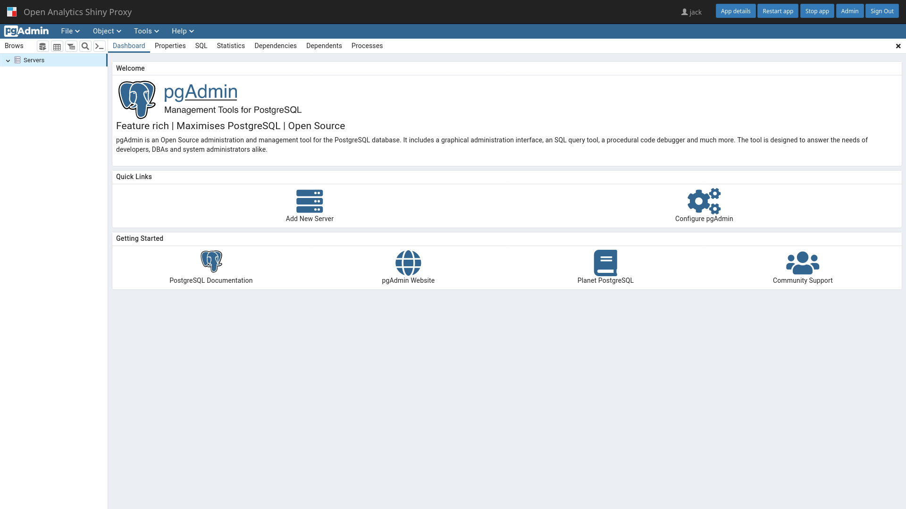

# Running pgAdmin inside ShinyProxy

[Screenshot](#screenshot)

ShinyProxy can run pgAdmin using
their [official Docker images](https://hub.docker.com/r/dpage/pgadmin4). For
most use cases there is no need to make changes to this Docker image.

## ShinyProxy Configuration

**Note:** ShinyProxy 2.6.0 or later is required for running pgAdmin notebooks.

Create a ShinyProxy configuration file (see [application.yml](application.yml)
for a complete file)

```yaml
- id: pgadmin
  container-image: dpage/pgadmin4:latest
  port: 80
  target-path: "#{proxy.getRuntimeValue('SHINYPROXY_PUBLIC_PATH')}"
  container-env:
    SCRIPT_NAME: "#{proxy.getRuntimeValue('SHINYPROXY_PUBLIC_PATH').replaceFirst('/$','')}"
    PGADMIN_CONFIG_MASTER_PASSWORD_REQUIRED: "False"
    PGADMIN_CONFIG_SERVER_MODE: "False"
    PGADMIN_DEFAULT_EMAIL: "user@example.com"
    PGADMIN_DEFAULT_PASSWORD: "password"
```

**Note**: pgAdmin takes some time to startup, therefore
the [`container-wait-time`](https://shinyproxy.io/documentation/configuration/#container-wait-time)
parameter must be changed to a higher value, e.g.:

```yaml
proxy:
  container-wait-time: 60000
```

## Adding default configuration

It is possible to add some default configuration to the Dockerfile. This config
file can be generated using the pgAdmin UI:

1. create a connection in the pgAdmin ui
2. click on `Tools`, `Import/Export servers`
3. in the dialog choose `Export`
4. provide a filename, e.g. `/tmp/servers.json`
5. click `Next`
6. choose the servers to export
7. click `Finish`

Next copy the `/tmp/servers.json` file from the running Docker container:

```bash
docker ps
docker cp <container_id>:/tmp/servers.json servers.json
```

Finally, create a custom Dockerfile:

```Dockerfile
FROM dpage/pgadmin:latest

COPY servers.json /pgadmin4/servers.json
```

## Screenshot



**(c) Copyright Open Analytics NV, 2023.**
